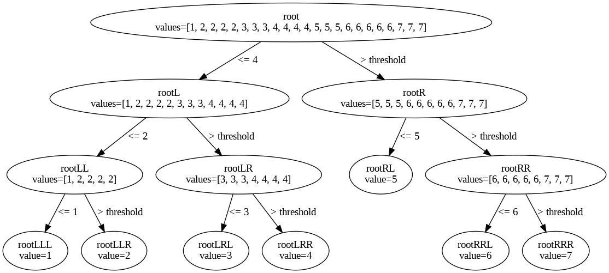

 
This repo contains practical examples of classic Machine Learning algorithms and concepts, implemented using Python and Jupyter Notebooks.

---

## 📌 About

Hi! I’m **Ashish Divvela**, a Computer Science freshman at **IIT (ISM) Dhanbad**. This repository contains the code and notebooks showing how I explored different areas of the **Machine Learning (ML)** domain during my learning journey.

---

## 🧠 What’s Inside

This repository includes Jupyter Notebooks that demonstrate key ML models and techniques:

| Notebook | Description |
|----------|-------------|
| `LinearRegression.ipynb` | Simple linear regression model to fit and predict continuous data.  |
| `PolynomialRegression.ipynb` | Extends linear regression to a polynomial relationship.  |
| `LogisticRegression.ipynb` | Binary classification using logistic regression.  |
| `KNearestNeighbours.ipynb` | KNN classification algorithm exploration.  |
| `KMeansClustering.ipynb` | Unsupervised learning using K-Means clustering.  |
| `DecisionTrees.ipynb` | Decision Tree model for classification/regression tasks. Includes visual example </img>.|
| `JAX-JIT-Linear-Regression.ipynb` | Linear regression implemented with JAX and JIT compilation for performance.  |
| `nn.ipynb` | A basic Neural Network example introduced from scratch.  |
|`custom-jax-vs-scikit-learn.ipynb`|Compares my linear regression to Scikit-Learns Module|

---

## 🛠️ Key Technologies Used

- **Python**
- **Jupyter Notebook**
- **NumPy / Pandas**
- **Scikit-learn**
- **JAX** (for accelerated computation in `JAX-JIT-Linear-Regression.ipynb`) :contentReference[oaicite:9]{index=9}

---

## 📁 Repository Structure
├── DecisionTrees.ipynb  
├── JAX-JIT-Linear-Regression.ipynb  
├── KMeansClustering.ipynb   
├── KNearestNeighbours.ipynb  
├── LinearRegression.ipynb  
├── LogisticRegression.ipynb  
├── PolynomialRegression.ipynb  
├── nn.ipynb  
├── decision_tree.png  
├── custom-jax-vs-scikit-learn.ipynb  
└── README.md  

